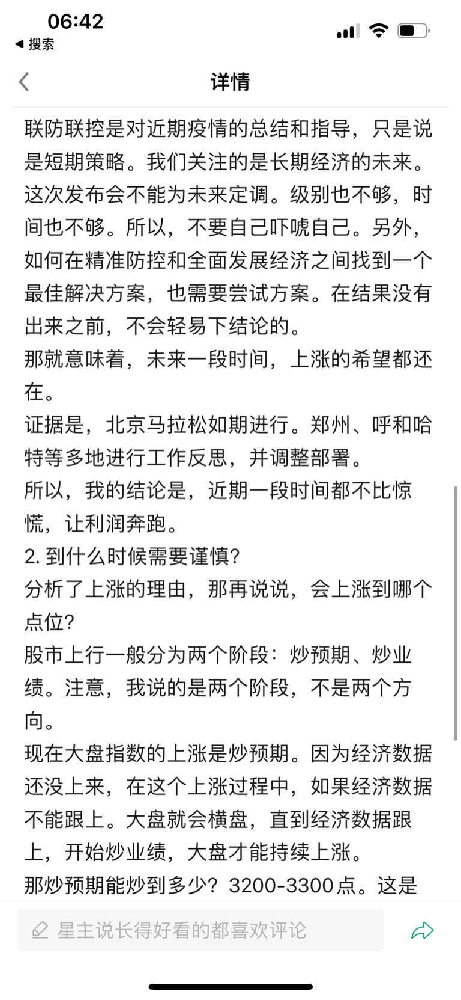

# 今天能否开启继续暴涨行情？

昨天我又一次表明观点，安心持股，大盘最好回踩。实际上大盘确实回踩了，好事儿。跌怕了的朋友又是一惊一乍的。今年的行情让很多人成了惊弓之鸟，买不准，拿不住。如果真成了这种心态，那还不如退出股市呢。

简单分析一下，昨天早盘有一波杀跌，是因为证券时报有一篇文章，批了近期大家对明年三月份的美好愿望。这可以理解，现在这么传，以后就好像被安排了一样。未确定的事儿大家知道就行。

但是，不重要，并没有否定什么。并且，我昨天文章中被删的部分也说的很清楚。现在是在找疫情防控和经济发展的平衡点。

我在大家一起来复盘的里也说的很明确了。种种迹象表明，我们在朝着好的方向前行。

盘后没有太多大新闻，美股也涨了。

同时出口数据虽然没给惊喜，但按人民币口径统计，还可以。

那就是说近期没有大风险，希望还是有的，大盘就震荡上行吧。

所以，今天就简单点，持股待涨。

就这。个人观点，不做投资依据。
