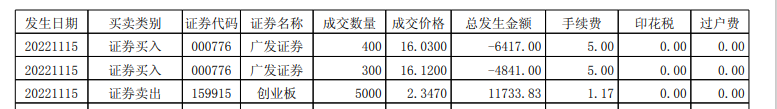

# 入门知识【编写中】

## 1. 开通账户

想炒股第一步就是得有个证券账户，同时这个账号里得有钱，你才能开始炒股。这篇文章会解决你开户中可能会遇到的问题。

## 1.1 选择券商

现在市面上这么多证券公司（东方财富、中信证券、中信建投、海通证券、华泰证券、广发证券、光大证券、国金证券等等），我们该选择哪家证券公司来开户？

### 1.1.1 选择依据

我总结了几个参考点：`手续费`、`消息获取速度` `、 软件体验 `、 `交流体验 `、`服务态度`。

他们的重要性是这样的：`手续费` > `消息获取速度 `>`软件体验 `>`交流体验 `>`服务态度`

为什么要这么排列，就得先解释几个重要的概念。

很多在股市好几个月的散户都不知道，你的每一笔交易都是要收费的。如果你因为恐慌，对一只股票平买平出，你可能以为自己没有亏钱，但实际上却是亏了一笔钱的。你的资金量越大，亏的越多。如果每天都这么操作一下，你可能一个月就亏了好几千块呢。或许你觉得这些钱不多，但行情不好的时候，你可能一个月仅股票的面值都亏好几万，再加上这看不上眼的几千的损失，绝对让人心疼不已。

说这么多，就是告诉你，只要你不赚钱，每一笔交易都是亏钱的。

**交易费**

那么每笔交易，我们会亏哪些钱，会亏多少呢？

往下看：

下图中是我从近期交易中导出的交割单。从交割单上可以看出，一笔交易中除了买和买的金额，最后还有3个费用（`手续费`、`印花税`、`过户费)`

**手续费** ：

-`券商`收到的为你服务的费用。是的，你在他们那儿开户，你每买卖一次股票，券商就收你一笔手续费。从上面的交割单上可以看出，买一笔和卖一笔都是要收手续费的。

- 不同券商收的比例不一样。比如东方财富（简称：东财）股票交易默认是0.3‰(也就是常说的万三)，也就是说如果你这笔交易花了10000块钱，那你得给东财交3块钱。买卖操作都得交。这就以为着如果你买了10000块钱的股票，后来觉得行情不好，又卖了。你交给券商的手续费就有 `买时交的3块钱（万五的交易费）+卖时交的3块钱）=6块钱` 。如果发生金额低于10000，按一万算。ETF场内基金的手续费就是0.15‰。

- 同一券商不同资金量的比例也不一样。还是以东财为例。默认开户是万五，如果你的入账资金超过50万，可以跟你的客户经理或者客服说，改成万三，甚至更低。不要小看这万分之二的差距，能替你生很多钱。一会儿我会列个公式让你了解一下，这一点差距能给你省多少钱。

**印花税** ：

卖时交给，比例为1‰。票印花税是我国统一征收的，由财政部门征收的，券商代收。

**过户费** ：

买卖时都收，为交易金额的万分之0.1。交易10000块钱时，要交0.1元的过户费。这个也是国家统一收。不能变。

把上面3个费用搞清楚了。你就知道印花税和过户费都是不能免的，也都是证监会统一的。但是，`手续费` 是不同的券商征收不同的比例。我们选择券商当然要选费率低的才好。

下面以股票为例提供一个公式，可以看出手续费对你年收益的影响有多大。

1、假如您的资金量为10万元，每月交易4次，交易费为0.1‰、0.2‰、0.3‰等三种费率情况下的交易成本节约一览表

| 权证交易客户 | 资金量 | 每年交易次数 | 年交易量 | 手续费 | 每年交易成本 | 每年节约成本 | 节约成本产生的收益率 |
| :----------: | ------ | ------------ | -------- | ------ | ------------ | ------------ | -------------------- |
|      A      | 10万   | 48           | 960万    | 0.1‰  | 960          | 19200        | 19.2%                |
|      B      | 10万   | 48           | 960万    | 0.2‰  | 1920         | 9600         | 9.6%                 |
|      C      | 10万   | 48           | 960万    | 0.3‰  | 2880         | 0            | 0%                   |
|     ---     | ---    | ---          | ---      | ---    | ---          | ---          | ---                  |
|              |        |              |          |        |              |              |                      |

其实一般来股市玩的，都不会只投入10万资金，

2、那我们再假设投入20万元，每月交易20次，佣金为0.1‰、0.2‰、0.3‰等三种费率情况下的交易成本节约一览表:

| 权证交易客户 | 资金量 | 每年交易次数 | 年交易量 | 手续费 | 每年交易成本 | 每年节约成本 | 节约成本产生的收益率 |
| :----------: | ------ | ------------ | -------- | ------ | ------------ | ------------ | -------------------- |
|      A      | 10万   | 240          | 4800万   | 1‰    | 48000        | 96000        | 96%                  |
|      B      | 10万   | 240          | 4800万   | 2‰    | 96000        | 48000        | 48%                  |
|      C      | 10万   | 240          | 4800万   | 3‰    | 144000       | 0            | 0%                   |

看到了吗？如果你的手续费能低万分之2

开账户最需要注意的是什么？**交易佣金**。特别强调，这个非常重要，如果选择不当，会让多损失很多钱。

什么是交易佣金？

不同的证券公司在给新人开

## 1.2 开户流程

开户就比较简单了，现在移动应用都很方便，大部分券商开户都不需要去现场。

证券账户开户有两个方法：**1.营业部柜台办理；2.网上在线办理开户**

> **1.营业部柜台办理** ：这种方式适合上网不方便的人。本人到证券公司的营业部柜台办理。准备好：`身份证`和 `银行卡`，到营业部取号排队，等到你时候把资料给柜员办理开户。去营业部柜台办理开户差不多需要2-3小时，如果人多可能会更长时间。这种对于上班一族不是很方便，比较适合年纪比较大不会手机操作的。

> **2.网上在线办理开户**: 网上开户是现在最便捷的方式，随时随地可以进行开户，开户仅需15分钟就可以完成了。网上开户对年龄有一定限制，需要18-70周岁。开户需要准备好身份证和银行卡，然后在手机应用市场下载券商app办理开户。
>
> 具体流程如下：
>
> - 通过手机的应用商店，下载证券APP，比如 `东方财富`、`中信证券`、`海通证券` 等。选择哪个证券公司这里有个讲究。你需要提前做一些工作，就是分别跟他们客服打电话，咨询一下他们的 吧 打开app点击首页急速开户，输入手机号获取验证码。

2.上传身份证正反面照片，需要清晰，不能缺边缺角

3.完善个人信息，地址要精确到门牌号，这个很重要，一定要填写

4.录制视频，录制视频必须露出五官，要大声说我自愿在某某券商开户

5.绑定三方存管银行卡，并且设置交易密码和资金密码

6.风险评估，做20道选择题，根据实际情况选择就可以了

7.提交开户申请，等待审批，审核通过之后会有电话回访注意接听。

一般网上开户审核还是比较快的，当天4点之前申请的基本上都可以开出来，t+1就可以进行交易了。开户之后记得做银证转账激活，部分银行需要在银行app做首次银证转账。

## 2. 看懂K线图

## 3. 买卖操作

## 4. 集合竞价

## 5. 交易量

## 6. 股票估值
